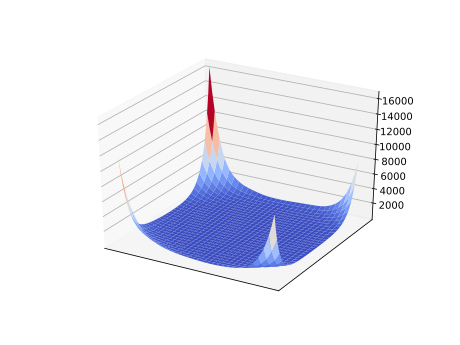
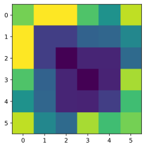

# anatome 

Ἀνατομή is a PyTorch library to analyze internal representation of neural networks

This project is under active development and the codebase is subject to change.

Note the name of the pypi package is `ultimate-anatome` but the python import is done with
the original name `import anatome`.
Test via:
```angular2html
python -c "import anatome.my_utils as my_utils;my_utils.hello()"
python -c "import anatome.my_utils as my_utils;my_utils.my_anatome_test()"
```

Credit to original library: https://github.com/moskomule/anatome

## Installation

If you are going to use a gpu the do this first before continuing 
(or check the offical website: https://pytorch.org/get-started/locally/):
```angular2html
pip3 install torch==1.9.1+cu111 torchvision==0.10.1+cu111 torchaudio==0.9.1 -f https://download.pytorch.org/whl/torch_stable.html
```
Otherwise, just doing the follwoing should work.
```
pip install ultimate-anatome
```

## Manual installation [for Development]

To use code first get the code from this repo (e.g. fork it on github):

```
git clone git@github.com:brando90/ultimate-anatome.git
```

Then install it in development mode in your python env with python >=3.9.
E.g. create your env with conda:

```
conda create -n ultimate_anatome_env python=3.9
conda activate ultimate_anatome_env
```

Then install code in edibable mode and all it's depedencies with pip in the currently activated conda environment:

```
pip install -e ~/ultimate-anatome
```

## Available Tools

### Representation Similarity

To measure the similarity of learned representation, `anatome.SimilarityHook` is a useful tool. Currently, the following
methods are implemented.

- [Raghu et al. NIPS2017 SVCCA](https://papers.nips.cc/paper/7188-svcca-singular-vector-canonical-correlation-analysis-for-deep-learning-dynamics-and-interpretability)
- [Marcos et al. NeurIPS2018 PWCCA](https://papers.nips.cc/paper/7815-insights-on-representational-similarity-in-neural-networks-with-canonical-correlation)
- [Kornblith et al. ICML2019 Linear CKA](http://proceedings.mlr.press/v97/kornblith19a.html)
- [Ding et al. arXiv Orthogonal Procrustes distance](https://arxiv.org/abs/2108.01661)

```python
import torch
from torchvision.models import resnet18
from anatome import DistanceHook
from anatome.my_utils import remove_hook

model = resnet18()
hook1 = DistanceHook(model, "layer3.0.conv1")
hook2 = DistanceHook(model, "layer3.0.conv2")
model.eval()
with torch.no_grad():
    model(torch.randn(128, 3, 224, 224))
# downsampling to (size, size) may be helpful
hook1.distance(hook2, size=8)
hook1.clear()
hook2.clear()
remove_hook(model, hook1)
remove_hook(model, hook2)
```

or to test do:
```python
from anatome.my_utils import my_anatome_test
my_anatome_test()
```

### Loss Landscape Visualization

- [Li et al. NeurIPS2018](https://papers.nips.cc/paper/7875-visualizing-the-loss-landscape-of-neural-nets)

```python
from anatome import landscape2d

x, y, z = landscape2d(resnet18(),
                      data,
                      F.cross_entropy,
                      x_range=(-1, 1),
                      y_range=(-1, 1),
                      step_size=0.1)
imshow(z)
```




### Fourier Analysis

- Yin et al. NeurIPS 2019 etc.,

```python
from anatome import fourier_map

map = fourier_map(resnet18(),
                  data,
                  F.cross_entropy,
                  norm=4)
imshow(map)
```



## Citation

If you use this implementation in your research, please conser citing my version of anatome:
```
@software{miranda2021ultimate_anatome,
    author={Brando Miranda},
    title={My Anatome, a PyTorch library to analyze internal representation of neural networks},
    url={https://github.com/brando90/my_anatome},
    year={2021}
}
```
and the original version:

```
@software{hataya2020anatome,
    author={Ryuichiro Hataya},
    title={anatome, a PyTorch library to analyze internal representation of neural networks},
    url={https://github.com/moskomule/anatome},
    year={2020}
}
```
